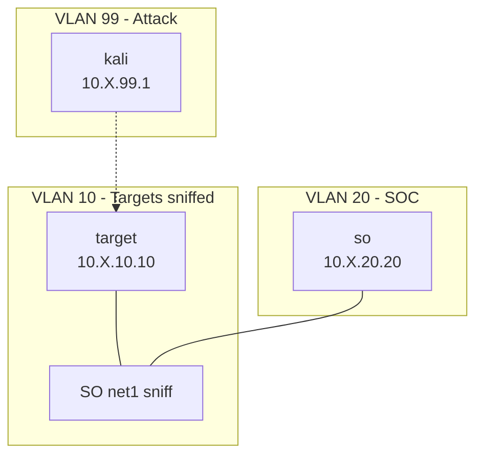

# Security Onion 2.4 Lab

Standalone Security Onion 2.4 with a Debian target and Kali. LUX attaches the sniff NIC and enables Ludus bridge hub-mode so SO can ingest VLAN 10 traffic.

## Quick Start

```bash
ludus source add https://github.com/ryokubaka/ludus-source-meow --all
ludus templates build -n securityonion-2.4-x64-template
ludus blueprint apply ryokubaka-ludus-source-meow/securityonion-lab
# Deploy via LUX (recommended) or:
ludus range deploy
```

## Network Diagram



> Replace `X` with your range's second octet (`ludus range list`).

## VM Details

| VM Name | Template | IP | Role |
|---|---|---|---|
| `{{ range_id }}-so` | securityonion-2.4-x64-template | 10.X.20.20 | Standalone SO |
| `{{ range_id }}-target` | debian-12-x64-server-template | 10.X.10.10 | target |
| `{{ range_id }}-kali` | kali-x64-desktop-template | 10.X.99.1 | attacker |

**RAM required:** ~38 GB  
**SO mode:** Standalone (`so-setup iso standalone-net`)

## Credentials

| Account | Username | Password | Scope |
|---|---|---|---|
| OS | onion | onion | SO SSH (template default) |
| SOC | onionadmin@ludus.local | 0n10nAdm1n! | Security Onion Console |
| Kali | kali | kali | attacker |

SOC UI: `https://10.X.20.20`

## LUX sniff lifecycle

During deploy, LUX (root SSH to Proxmox):

1. Sets `bridge-ageing 0` on `vmbr10XX`
2. Adds SO `net1` tagged VLAN 10 (sniff, no IP)
3. On range delete, removes `net1` and restores ageing when no sniff NICs remain

No manual host steps.
