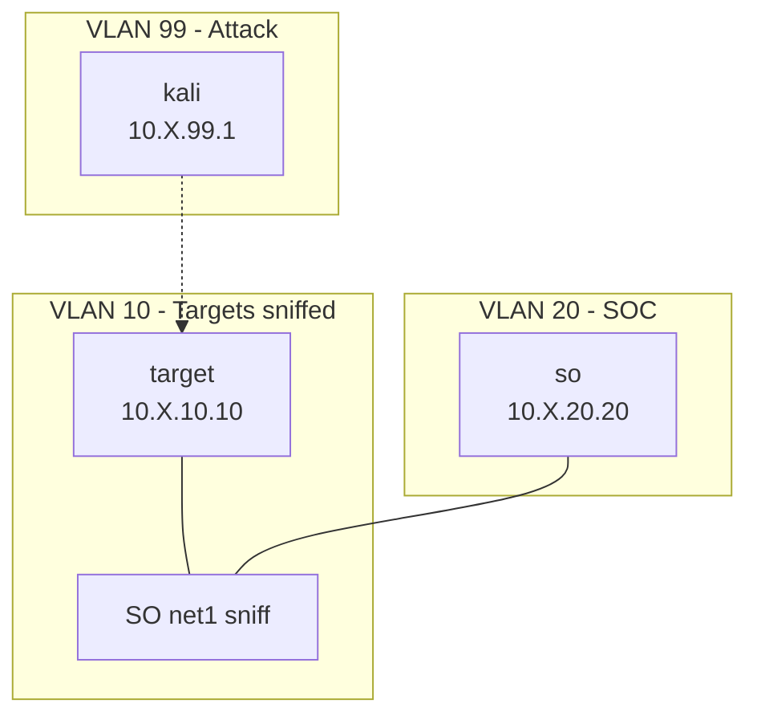

# Security Onion 3 Lab

Standalone Security Onion 3 with a Debian target and Kali. Same topology as `securityonion-lab`; uses `securityonion-3-x64-template`.

## Quick Start

```bash
ludus source add https://github.com/ryokubaka/ludus-source-meow --all
ludus templates build -n securityonion-3-x64-template
ludus blueprint apply ryokubaka-ludus-source-meow/securityonion3-lab
ludus range deploy
```

## Network Diagram



## Credentials

| Account | Username | Password | Scope |
|---|---|---|---|
| OS | onion | onion | SO SSH |
| SOC | onionadmin@ludus.local | 0n10nAdm1n! | Console |
| Kali | kali | kali | attacker |

SOC: `https://10.X.20.20` — `ludus_securityonion` attaches sniff `net1` during deploy.
