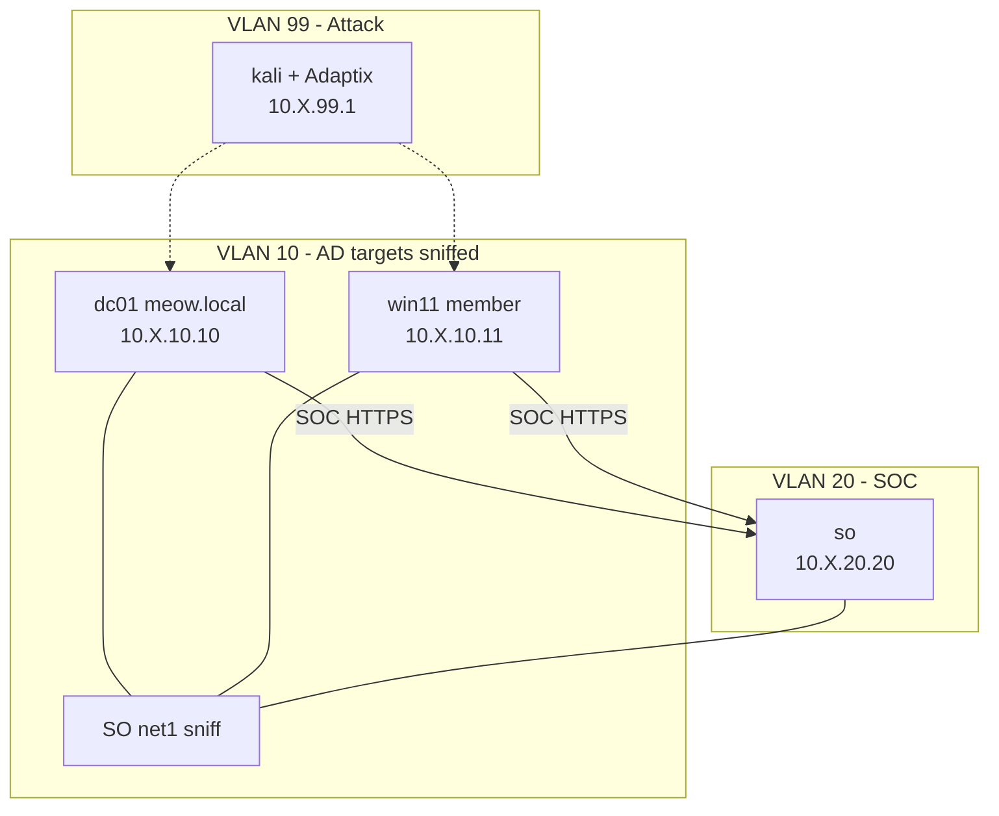

# Security Onion 3 Lab

Standalone Security Onion 3 with a `meow.local` domain (Win2019 DC + domain-joined Win11), Kali attacker with [Adaptix C2](https://github.com/badsectorlabs/ludus_adaptix_c2), and Fleet agents on the AD hosts. Same topology as `securityonion-lab`; uses `securityonion-3-x64-template`.

## Quick Start

```bash
ludus source add https://github.com/ryokubaka/ludus-source-meow --all
ludus templates build -n securityonion-3-x64-template,win2019-server-x64-template,win11-22h2-x64-enterprise-template,kali-x64-desktop-template
ludus blueprint apply ryokubaka-ludus-source-meow/securityonion3-lab
ludus range deploy
```

## Network Diagram



> Replace `X` with your range's second octet (`ludus range list`).

## VM Details

| VM Name | Template | IP | Role |
|---|---|---|---|
| `{{ range_id }}-so` | securityonion-3-x64-template | 10.X.20.20 | Standalone SO |
| `{{ range_id }}-dc01` | win2019-server-x64-template | 10.X.10.10 | primary-dc `meow.local` + Fleet agent |
| `{{ range_id }}-win11` | win11-22h2-x64-enterprise-template | 10.X.10.11 | domain member + Fleet agent |
| `{{ range_id }}-kali` | kali-x64-desktop-template | 10.X.99.1 | attacker + Adaptix C2 |

**RAM required:** ~36 GB (SO 24 + DC 4 + Win11 4 + Kali 4; SO min=max 24)  
**Domain:** `meow.local`

## Credentials

| Account | Username | Password | Scope |
|---|---|---|---|
| OS | onion | onion | SO SSH |
| SOC | onionadmin@ludus.local | 0n10nAdm1n! | Console |
| Domain admin | `MEOW\domainadmin` | `password` | `meow.local` (Ludus defaults) |
| Domain user | `MEOW\domainuser` | `password` | `meow.local` |
| Windows local | `localuser` | `password` | DC / Win11 local admin |
| Kali | kali | kali | attacker |
| Adaptix | any username | `pass` | teamserver `localhost:4321` /endpoint |

SOC: `https://10.X.20.20` (VLAN 10 blue team + WireGuard; Kali/red team blocked) — sniff `net1` attached during deploy.  
Adaptix: on Kali run `adaptixclient` → `https://127.0.0.1:4321/endpoint` (password `pass`). WireGuard can reach Kali `:4321`.

## Adding SO / agents to an existing range

Fleet agents need **role-level** `depends_on` (VM-level is ignored):

```yaml
roles:
  - name: ryokubaka.ludus_so_elastic_agent
    depends_on:
      - vm_name: "{{ range_id }}-so"
        role: ryokubaka.ludus_securityonion
```

## Requirements

- Ludus v2.0+
- Templates built: `securityonion-3-x64-template`, `win2019-server-x64-template`, `win11-22h2-x64-enterprise-template`, `kali-x64-desktop-template`
- Galaxy role: `badsectorlabs.ludus_adaptix_c2` (declared in `requirements.yml`)
