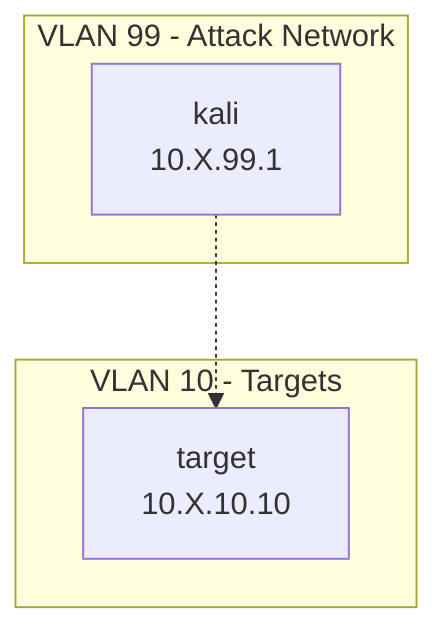

# Starter Lab

Minimal Ludus blueprint: Kali attacker + Debian target. Copy this directory when adding new labs.

## Quick Start

```bash
ludus source add https://github.com/ryokubaka/ludus-source-meow
ludus blueprint apply ryokubaka-ludus-source-meow/starter-lab
ludus range deploy
```

Local upload form:

```bash
ludus source add -d . --id meow --blueprints starter-lab
ludus blueprint apply meow/starter-lab
ludus range deploy
```

## Network Diagram



> Replace `X` with your range's second octet (`ludus range list`).

## VM Details

| VM Name | Hostname | Template | IP | Role |
|---|---|---|---|---|
| `{{ range_id }}-target` | target | debian-12-x64-server-template | 10.X.10.10 | target |
| `{{ range_id }}-kali` | kali | kali-x64-desktop-template | 10.X.99.1 | attacker |

**Estimated deploy time:** ~15–25 minutes  
**RAM required:** ~6 GB

## Credentials

| Account | Username | Password | Scope |
|---|---|---|---|
| Kali | kali | kali | attacker box |
| Debian | debian / local Ludus defaults | (see Ludus template docs) | target |

## Requirements

- Ludus v2.0+
- Templates built: `debian-12-x64-server-template`, `kali-x64-desktop-template`